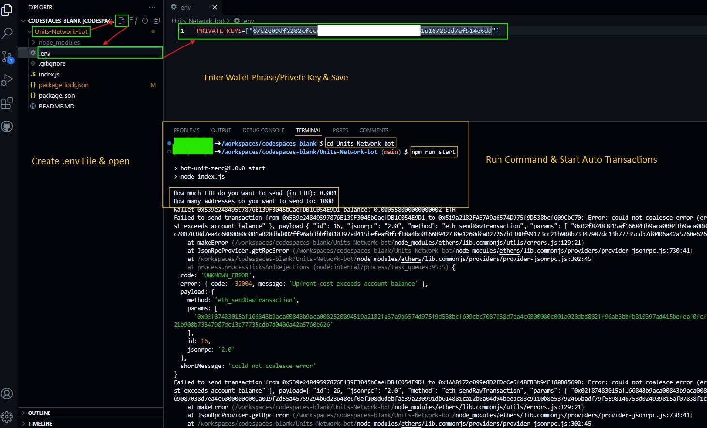

<p align="center">

</p>

### Open [VsCode](https://code.visualstudio.com/download) OR [Github CodeSpace](https://github.com/codespaces)

## Steps

### 1. Clone Repository

```bash
git clone https://github.com/BidyutRoy2/kakarot-testnet-bot.git
```

```
cd kakarot-testnet-bot
```

### 2. Instal Dependency

```bash
npm install
```

### 3. configurate .env File

Create a file named .env in the project root directory.

```bash
touch .env
```

```bash
nano .env
```

```bash
SEED_PHRASES=["your seed phrase 1", "your seed phrase 2"]
PRIVATE_KEYS=["your private key 1", "your private key 2"]
```

### 4. Run script

```bash
npm run start
```

\*Make sure you have Node.js and git installed on your system.

### Latest Airdrops Join Telegram

### Join Telegram:[HiddenGemNews](https://t.me/hiddengemnews)
